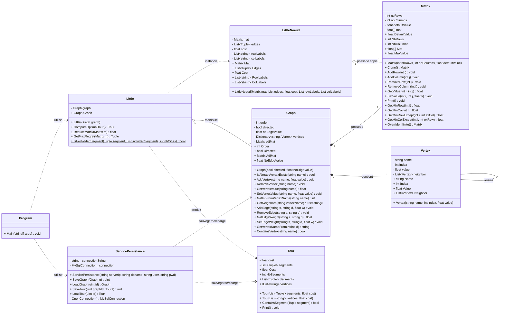
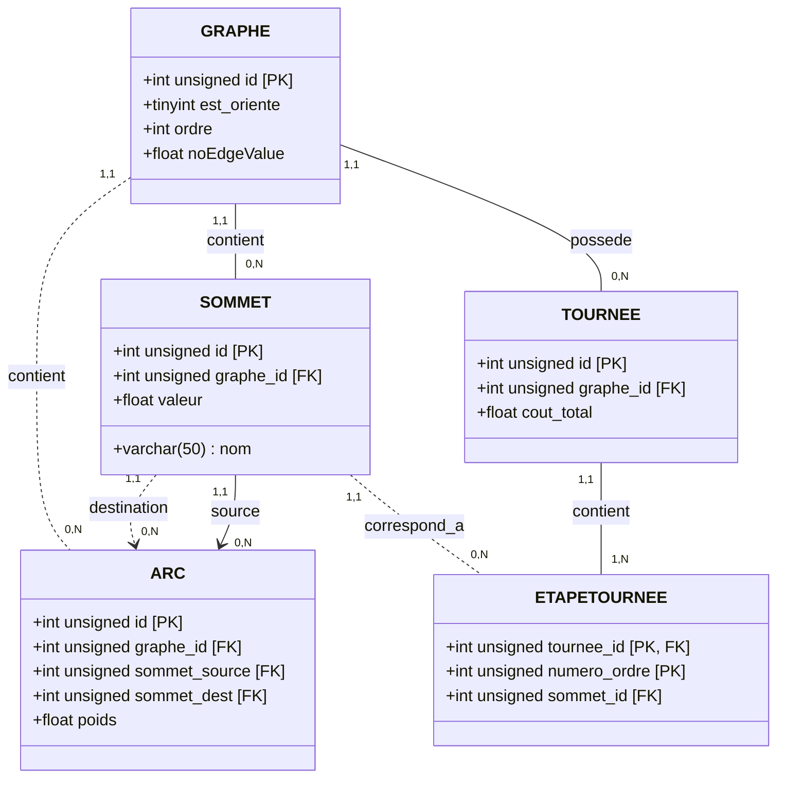

# TourneeFutee

Projet PSI A2 S4 consacre a la modelisation de graphes, au calcul de tournees optimales et a la persistance des resultats en base MySQL.

Le coeur du projet est une application .NET 8 en C#. Elle fournit des classes pour manipuler des graphes ponderes, representer des matrices d'adjacence, resoudre un probleme de voyageur de commerce avec l'algorithme de Little et sauvegarder/recharger graphes et tournees.

## Membres du groupe

- Alexandre LESUR
- Loris LIGONNIERE
- Antoine MASCIOTRA

## Fonctionnalites

- Creation de graphes orientes ou non orientes.
- Ajout, suppression et modification de sommets et d'arcs ponderes.
- Representation interne par matrice d'adjacence.
- Manipulation de matrices : insertion/suppression de lignes et colonnes, lecture/ecriture de coefficients, reduction de matrice.
- Calcul d'une tournee optimale avec l'algorithme de Little.
- Representation d'une tournee sous forme de segments et de cout total.
- Sauvegarde et chargement de graphes/tournees dans une base MySQL.
- Tests unitaires MSTest sur les graphes, matrices et l'algorithme de Little.
- Tests d'integration pour la persistance MySQL.

## Structure du depot

```text
.
|-- TourneeFutee.sln
|-- TourneeFutee/
|   |-- Graph.cs                 # Graphe oriente/non oriente et matrice d'adjacence
|   |-- Matrix.cs                # Matrice de couts et operations de base
|   |-- Little.cs                # Algorithme de Little
|   |-- LittleNoeud.cs           # Etat interne d'une branche de Little
|   |-- Tour.cs                  # Resultat d'une tournee
|   |-- Vertex.cs                # Sommet interne du graphe
|   |-- ServicePersistance.cs    # Acces MySQL
|   `-- Program.cs               # Point d'entree console
|-- TourneeFutee.Tests/
|   |-- GraphTests.cs
|   |-- MatrixTests.cs
|   |-- LittleTests.cs
|   `-- PersistanceTestsMAJ2.cs
|-- init_db.sql                  # Initialisation de la base MySQL de test
|-- MetroParis.csv               # Donnees de stations du metro parisien
`-- .gitignore
```

## Diagramme de classes :



## Diagramme Entité/Association de la base de données



## Prerequis

- .NET SDK 8.0 ou plus recent.
- Visual Studio, Rider, VS Code ou un terminal compatible .NET.
- MySQL uniquement pour les tests et fonctions de persistance.

Les dependances NuGet principales sont :

- `MySql.Data`
- `System.Text.Encoding.CodePages`
- `MSTest`
- `Microsoft.NET.Test.Sdk`

## Installation

Depuis la racine du depot :

```bash
dotnet restore
dotnet build
```

## Lancer le projet

```bash
dotnet run --project TourneeFutee
```

Le point d'entree `Program.cs` est actuellement minimal. Les principales fonctionnalites sont exposees par les classes du projet et validees dans les tests.

## Utilisation rapide

Exemple de creation d'un graphe et de calcul d'une tournee :

```csharp
using TourneeFutee;

Graph graph = new Graph(directed: true);

graph.AddVertex("A");
graph.AddVertex("B");
graph.AddVertex("C");

graph.AddEdge("A", "B", 4);
graph.AddEdge("A", "C", 2);
graph.AddEdge("B", "A", 3);
graph.AddEdge("B", "C", 1);
graph.AddEdge("C", "A", 5);
graph.AddEdge("C", "B", 6);

Little little = new Little(graph);
Tour tour = little.ComputeOptimalTour();

Console.WriteLine($"Cout total : {tour.Cost}");
tour.Print();
```

Pour un calcul Little complet, le graphe doit representer un probleme de voyageur de commerce exploitable : les trajets necessaires doivent etre presents et les couts doivent etre coherents.

## Tests

Executer tous les tests :

```bash
dotnet test
```

Les tests de persistance utilisent une vraie base MySQL locale. Pour lancer uniquement les tests unitaires qui ne dependent pas de MySQL :

```bash
dotnet test --filter "FullyQualifiedName!~PersistanceTests"
```

## Base de donnees MySQL

La classe `ServicePersistance` permet de sauvegarder et charger :

- des graphes dans les tables `Graphe`, `Sommet` et `Arc` ;
- des tournees dans les tables `Tournee` et `EtapeTournee`.

Le script `init_db.sql` initialise une base de test nommee `tourneefutee_test`.

Configuration attendue par les tests d'integration :

```text
Serveur  : 127.0.0.1
Base     : tourneefutee_test
Utilisateur : root
Mot de passe : root
```

Initialisation possible depuis MySQL :

```sql
SOURCE init_db.sql;
```

Ou depuis un terminal, selon votre installation MySQL :

```bash
mysql -u root -p < init_db.sql
```

Adaptez les constantes `DB_SERVER`, `DB_NAME`, `DB_USER` et `DB_PWD` dans `TourneeFutee.Tests/PersistanceTestsMAJ2.cs` si votre environnement local est different.

## Donnees

`MetroParis.csv` contient des donnees de stations du metro parisien :

- identifiant de station ;
- ligne ;
- nom de station ;
- longitude et latitude ;
- commune et code INSEE.

Ce fichier est versionne car il sert de jeu de donnees projet. Il ne doit pas etre confondu avec des fichiers generes.

## Notes de developpement

- Les dossiers `bin/`, `obj/`, `.vs/` et `TestResults/` sont des artefacts locaux et ne doivent pas etre versionnes.
- Les fichiers `.env`, secrets, chaines de connexion privees et resultats de tests doivent rester hors Git.
- Les tests de persistance ecrivent dans une base de donnees : utilisez une base dediee au test.
- Certains fichiers source contiennent actuellement des commentaires avec des caracteres accentues mal encodes. Cela n'empeche pas la compilation, mais une normalisation UTF-8 pourra etre utile plus tard.

## Commandes utiles

```bash
dotnet restore
dotnet build
dotnet test
dotnet test --filter "FullyQualifiedName!~PersistanceTests"
dotnet run --project TourneeFutee
```
